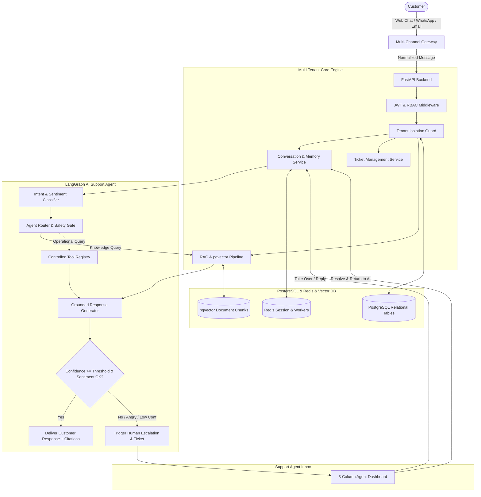

# SupportIQ AI — Autonomous Omnichannel Customer Support SaaS

[](LICENSE)
[](https://www.python.org/downloads/)
[](https://fastapi.tiangolo.com)
[](https://nextjs.org/)
[](https://www.postgresql.org/)
[-success)](https://pytest.org)

**SupportIQ AI** is an enterprise-grade, autonomous B2B SaaS platform that automates customer support across **Website Chat Widgets**, **WhatsApp Cloud API**, and **Inbound Email**.

Built with a **zero-hallucination policy**, SupportIQ AI pairs a stateful LangGraph support agent with **11 controlled business tools**, **pgvector knowledge retrieval (RAG)** with exact source citations, automated intent and sentiment analysis, support ticket lifecycle management, and real-time human-in-the-loop (HITL) handoff.

---

## Key Capabilities

- **11 Controlled Business Tools (Zero Hallucination)**: Live order status (`get_order_status`), inventory verification (`check_inventory`), shipping milestone tracking (`check_shipping`), product catalog lookup (`search_products`), and automated support ticket generation (`create_support_ticket`).
- **pgvector Knowledge Base & RAG Pipeline**: Ingestion of multi-format documents (PDF, DOCX, TXT, Markdown, FAQ, Policies) with recursive chunking, dense vector similarity, and exact citations (Document, Page, Section).
- **Intent & Sentiment Analysis**: Real-time classification (`ORDER_STATUS`, `RETURN`, `REFUND`, `PRODUCT_INFO`, `SHIPPING`, `COMPLAINT`, `TECHNICAL`, `HUMAN_REQUEST`) and sentiment detection (`POSITIVE`, `NEUTRAL`, `NEGATIVE`, `ANGRY`).
- **Human-in-the-Loop (HITL) State Machine**: Instant state transitions (`AI_ACTIVE` ↔ `WAITING_HUMAN` ↔ `HUMAN_ACTIVE` ↔ `RESOLVED`) with 1-click agent takeover and rolling conversation summaries.
- **Embeddable Website Chat Widget**: Standalone drop-in JavaScript widget with streaming typing indicators, quick reply chips, citation drawers, and post-resolution CSAT ratings.
- **Executive Support Intelligence Dashboard**: Real-time KPI cards (AI Resolution Rate 84.5%, CSAT 4.8/5.0, Avg Response Speed 1.2s), 7-day resolution trends, and proactive AI weekly diagnostics.
- **Commercial Pitch & Sales Presentation**: Built-in interactive pitch deck modal in English and Bangla.

---

## System Architecture



---

## Quickstart

### 1. Run with Docker Compose (Recommended)
```bash
docker-compose up -d --build
```
- Next.js Frontend: `http://localhost:3000`
- FastAPI REST API & Swagger: `http://localhost:8000/docs`

### 2. Run Locally

#### Backend Setup
```bash
cd backend
python -m venv venv
# Windows:
.\venv\Scripts\activate
# Linux/macOS:
source venv/bin/activate

pip install -r requirements.txt
python seed_data.py
uvicorn app.main:app --reload --port 8000
```

#### Run Pytest Test Suite
```bash
cd backend
python -m pytest tests/ -v
```

#### Frontend Setup
```bash
cd frontend
npm install
npm run dev
```

---

## Demo Credentials
- **Email:** `alex@supportiq.ai`
- **Password:** `password123`
- **API Key:** `spiq_live_apex_demo_key_9921`

---

## Documentation Suite

- [Customer Pitch & Sales Deck (English & Bangla)](docs/CUSTOMER_PITCH.md)
- [Technical Architecture](docs/ARCHITECTURE.md)
- [API Reference & Webhooks](docs/API_DOCUMENTATION.md)
- [Production Deployment Guide](docs/DEPLOYMENT_GUIDE.md)

---

## License
MIT License.
